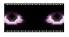
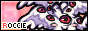

<h1 align="center">Bem-vindo ao Zeitgeist!</h1>

Esse é um jogo desenvolvido como parte de um projeto da cadeira de jogos do semestre 2023/2 da UFPel.

Em um cenário futurista, onde a artificialização moldou a sociedade humana, um grupo de pesquisadores iniciou experimentos para evoluir a humanidade. No entanto, os experimentos com animais, inicialmente bem-sucedidos, começaram a falhar, resultando em fusões grotescas e criaturas violentas.

Acompanhe a jornada de um herói que enfrenta desafios e descobre segredos sombrios enquanto busca salvar o mundo de uma ameaça emergente. Mergulhe nesta narrativa envolvente e desvende os mistérios que cercam o jogo.

  
  

<strong>Créditos:</strong> Feito por Anna Gabriele e Naomi Ribes.
Música por: o cara do itch

